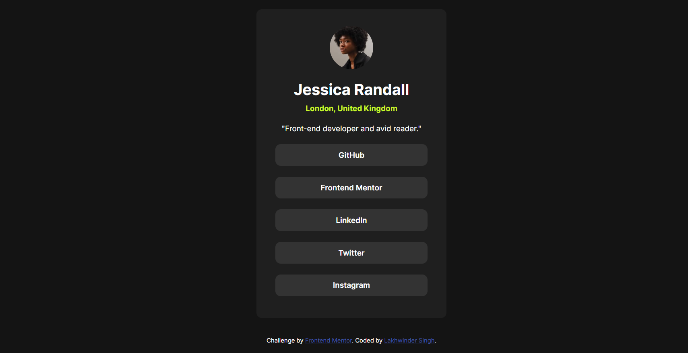

# Frontend Mentor - Social links profile solution

This is a solution to the [Social links profile challenge on Frontend Mentor](https://www.frontendmentor.io/challenges/social-links-profile-UG32l9m6dQ). Frontend Mentor challenges help you improve your coding skills by building realistic projects. 

## Table of contents

- [Overview](#overview)
  - [The challenge](#the-challenge)
  - [Screenshot](#screenshot)
  - [Links](#links)
- [My process](#my-process)
  - [Built with](#built-with)
  - [What I learned](#what-i-learned)
  - [Continued development](#continued-development)
  - [Useful resources](#useful-resources)
- [Author](#author)

## Overview

### The challenge

Users should be able to:

- See hover and focus states for all interactive elements on the page

### Screenshot


### Links

- Solution URL: [Visit here](https://github.com/Lakhwinderr/Frontend-Mentor---Social-links-profile)
- Live Site URL: [Visit here](https://frontend-mentor-social-links-profil-seven.vercel.app)

## My process
- Separated the visual components to node like structure and worked individually on each node.
- Defined CSS variables to make the dev process smooth and change the styling in a smooth manner.
### Built with

- Semantic HTML5 markup
- CSS custom properties
- Flexbox
- CSS Grid
- Mobile-first workflow


### What I learned

- Flexbox has two axes - main axis along the flex direction and other one cross axis that is perpendicular to the flex direction. 
- justify-content is along the main axis and align items works on the cross axis. 
- use href="#" but prevent default with inline handler so clicks won't reload.
```html
<!-- dividing the sections of the page to separate sections like main, footer, header, etc.  -->
<h1>
  <main></main>
  <footer></footer>
</h1>
```

```css
/* instead of applying class to each individual element in html you can choose to define all the elements with similar visual properties in one go using comma separator */
#card, #linkButton, img{
  border-radius: 50%
}
```
- Using empty hypertext reference ```href = ""``` reloads the same page and adds flickering to the page.
- Using ```href = "#"``` solves this problem but it navigates to top of the webpage.
- Furthermore preventing default behaviour of the event can solve our flickering and going to the top of page problem permanently.
```html
<a href = "#" onclick = "event.preventDefault()">Button</a>
```
-Use classes for repeating elements and ids for singular elements. Classes define the class or properties of the element and ids for identification.
But why it is recomended to use the id for singular element is still unclear. The singular element can appear many times in the page. However you must follow the HTML guidelines.
#### Update: 
✔ Use class when:

The element appears more than once

You’re defining appearance (color, size, animation)

You’re grouping similar items

✔ Use id when:

The element appears once per page

You need to target it specifically (JS, anchor links, unique layout)

It represents a unique region of the page (header, footer, hero section)

- Use classes for repeating elements and ids only for one-of-a-kind elements.
Classes describe the style or role of many elements, while ids uniquely identify a single element.
### Continued development
- The CSS properties and HTML resets on clicking the button. Why this happens and how we can solve this? The elements flicker on clicking the anchor elements.

#### Update:
- Using this in anchor tag solved this problem.
```html
<a href = "#" onclick = "event.preventDefault()">Some Button</a> 
``` 

## Author

- Website - [Lakhwinder Singh](https://lakhwinder.netlify.app)
- Frontend Mentor - [@Lakhwinderr](https://www.frontendmentor.io/profile/Lakhwinderr)
- Twitter - [@LakhwinderCode](https://www.twitter.com/LakhwinderCode)

